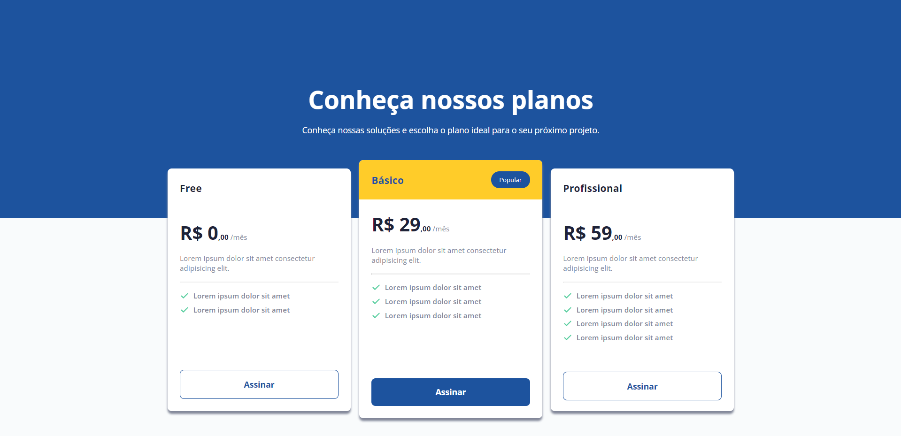
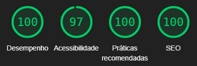

## 💰 Pricing Table 💸

  

### 🚀 Sobre

O Pricing Table é uma página Web que mostra os planos de serviço de uma empresa fictícia. É um dos desafios da trilha Discover.

### 🖼️ Projeto




### 💡 Lighthouse



### 🏃‍♂️ Como rodar o projeto

Realize um clone do repositório, abra a pasta e execute o arquivo index.html:

```bash
git clone https://github.com/Seiixas/pricing-table-discovery
cd pricing-table-discovery
```

Ou acesse o site on-line pelo Github Pages [clicando aqui](https://seiixas.github.io/pricing-table-discovery).
